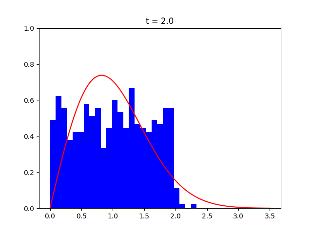

# HardDisks

This project simulates the movement of two dimensional disks within a box. All disks are 
initialized at random, non-overlapping positions with random velocities. Collisions of disks 
and walls are shown, as well as collisions between different disks. The dynamics of the disks 
should follow real physics of collisions, as you can see in the following animation:


## Project structure
All relevant codefiles for the simulation are located here within the root folder of the repository.

* `disk_movement.py` - contains function to calculate next collision times and update velocity vectors
after collisions
* `plotting.py` - all functions used for plotting are bundled here, for later use.
* `animation.py` - animates the movement of the disks either live or stores as GIF. For high
number of disks, the live animation is not running smoothly.
* `returntime.py` - Calculates the average return time for different numbers of disks.
* `distribution.py` - Animates the velocity distribution for all disks as histogram

## Return times

## Velocity distribution
If we initialize all disks with a absolute velocity drawn from a uniform velocity, the distribution 
of velocities will change over time, due to collisions between disks. As the system is closed, the 
temperature of the system will not change. Temperature can be defined via the kinetic energy and 
the equipartition theorem (here in 2D):
$$E_{kin} = \sum m_i * v_i^2$$
$$ \frac{E_{kin}}{N} = k_B T $$
Using $k_B = 1$ and assuming all disks have the same mass $m_i = 1$, results in: 
$$ T = \frac{\şum v_i**2}{N} $$
The Maxwell-distribution should model the velocity distribution in equilibrium. Using the same 
simplifications the Maxwell distribution can easily be plotted. 
Plotting the time evolution for an initial uniform velocity distribution, we find that it approaches
the Maxwell distribution for large times:



## Live animations
To run the live animations you need to have `TKinter` installed for python on your system.
This can be done by running ``` sudo apt-get install python3-tk``` on Ubuntu.  