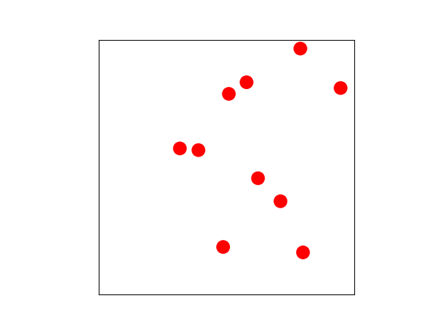

# HardDisks

This project simulates the movement of two dimensional disks within a box. All disks are 
initialized at random, non-overlapping positions with random velocities. Collisions of disks 
and walls are shown, as well as collisions between different disks. The dynamics of the disks 
should follow real physics of collisions, as you can see in the following animation:

